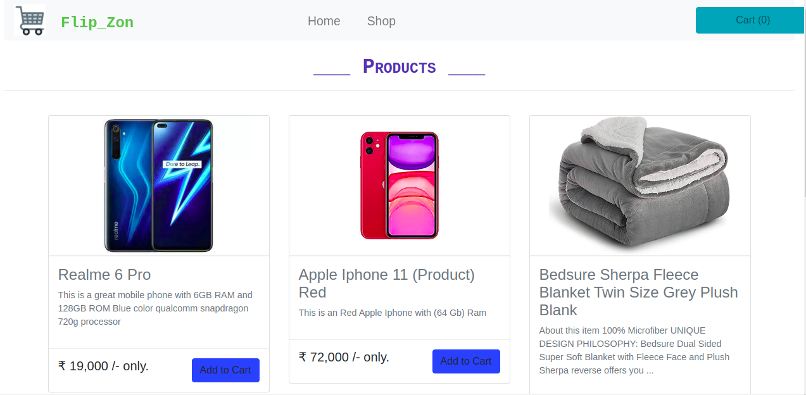

# Shopping-Cart-React

___

This a basic shopping cart application which was built using reactjs, bootstrap. 

The following screenshot displays the products home page.




____

## Requirements

- Node.js (version 14)
  - Install nodejs v14 or above

## Setup

- Clone the repo.
- Change to the project's working directory.
- Install the dependencies
  - ``` npm install ```

## Run

- Run the app
  - ``` npm start ```
